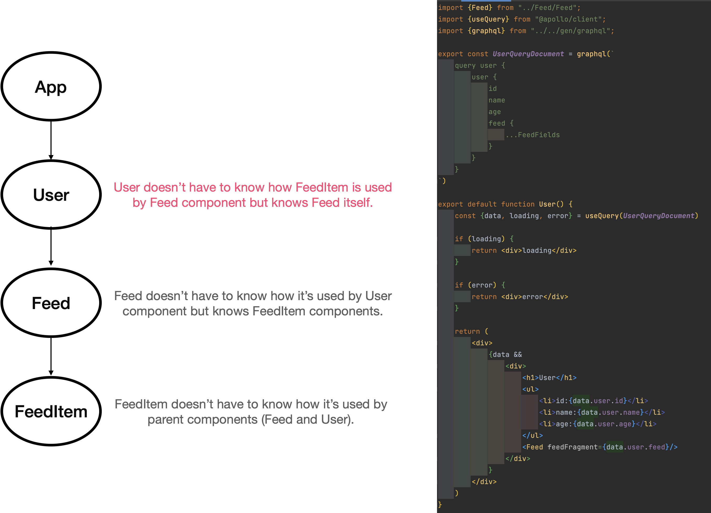
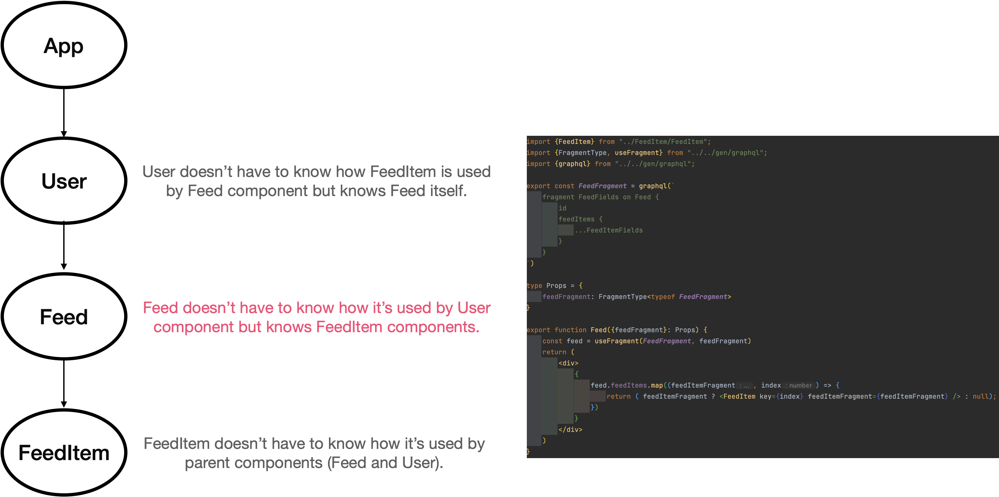
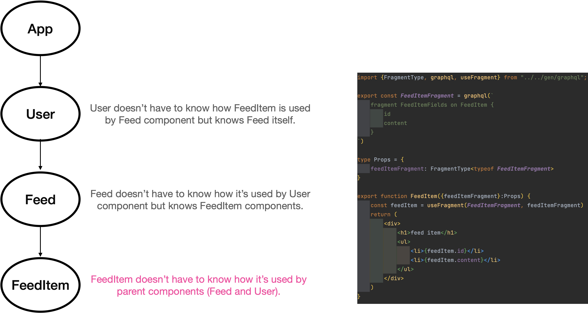

# apollo-graphql-codgen-fragment-colocation

## TL;DR

- A fragment is reusable sets of fields in GraphQL Query and Mutation.
- But, fragment compositions (flagment colocations) in React components gives us component-scoped data declaration.
  - this is similar to what we have achieved with CSS in JS.
- The fragment composition approach prevent us from unexpected under-fetching and over-fetching data because its always fetch only data components need.

## Concept

### Concern of User component



### Concern of Feed component



### Concern of FeedItem component



## Usage

### Run web app

```
npm run dev
```

### Run GraphQL server

```
npm run mock
```

### Generate GraphQL code using GraphQL Codegen

See https://www.the-guild.dev/graphql/codegen/docs/guides/react-vue

```
npm run codegen

or

npm run codgen:watch
```
